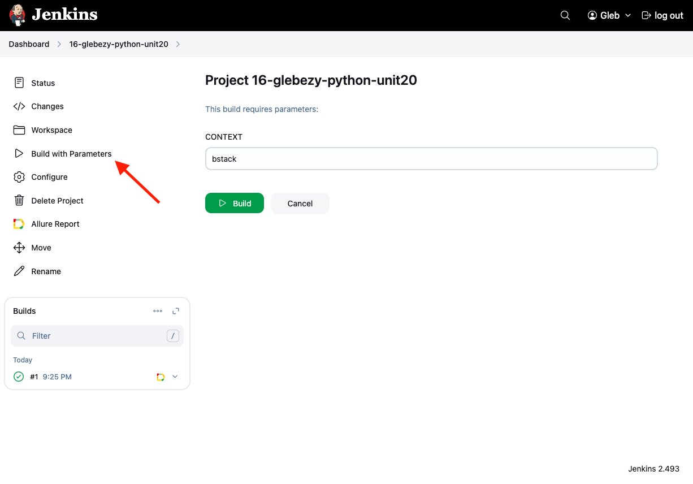
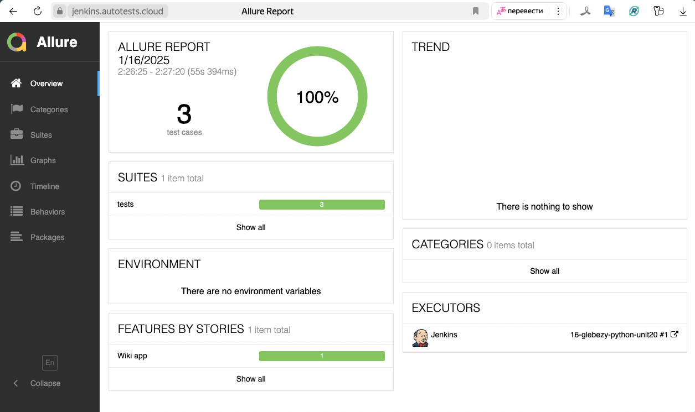
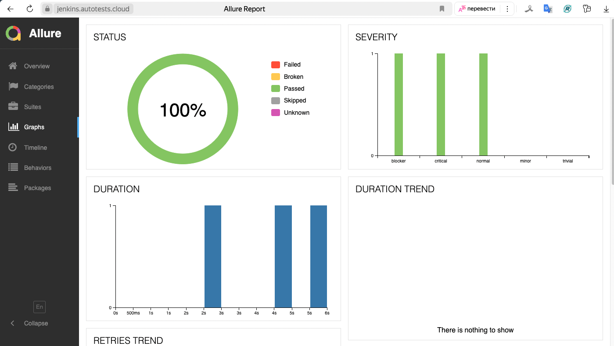
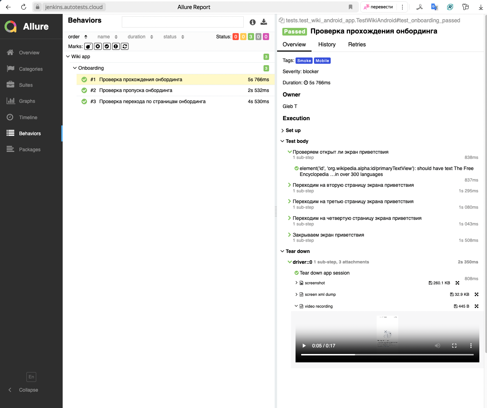
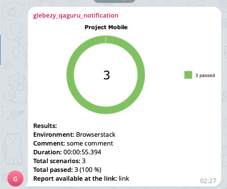

## Проект Mobile автотестов Wikipedia

<!-- Технологии -->

### Используемые технологии

  <code></code>
  <code></code>
  <code></code>
  <code></code>
  <code></code>
  <code></code>
  <code></code>
  <code></code>
  <code></code>
  <code></code>

<!-- Тест кейсы -->

### Что проверяем
* Прохождение онбординга
* Пропуск онбординга
* Навигация по онбордингу 

<!-- Jenkins -->

###  Запуск проекта в Jenkins

### [Job](https://jenkins.autotests.cloud/job/16-glebezy-python-unit20/)

##### При нажатии на "Build with Parameters" открывается форма заполнения параметров
##### после которой происходит сборка тестов и их прохождение, через виртуальную машину в BrowserStack.

<!-- Allure report -->

###  Allure report

##### После прохождения тестов, результаты можно посмотреть в Allure отчете

##### Во вкладке Graphs можно посмотреть графики о прохождении тестов, по их приоритизации, по времени прохождения и др.

##### Во вкладке Behaviors находятся собранные тест кейсы, у которых описаны шаги и приложены аттачи о прохождении теста

<!-- Appium -->

###  Скринкаст прохождения тестов используя Appium

https://github.com/user-attachments/assets/bbef3612-7e24-47f2-8c88-b57f35cd5791

<!-- Telegram -->

###  Интеграция с Telegram
##### После прохождения тестов, в Telegram-бот приходит сообщение с графиком и небольшой информацией о тестах.

